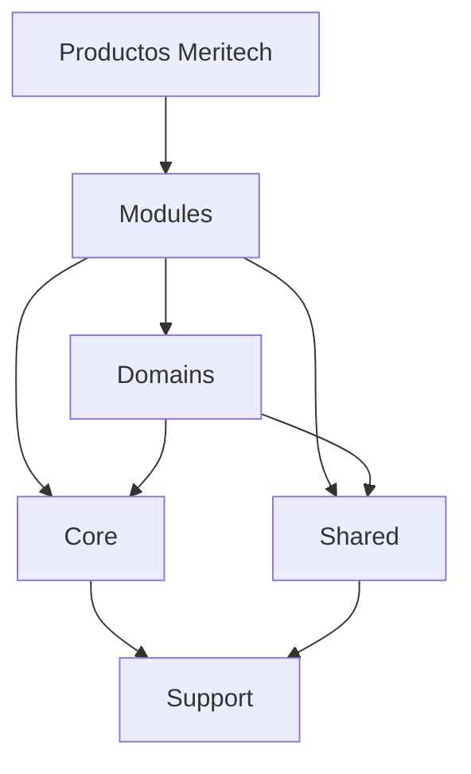
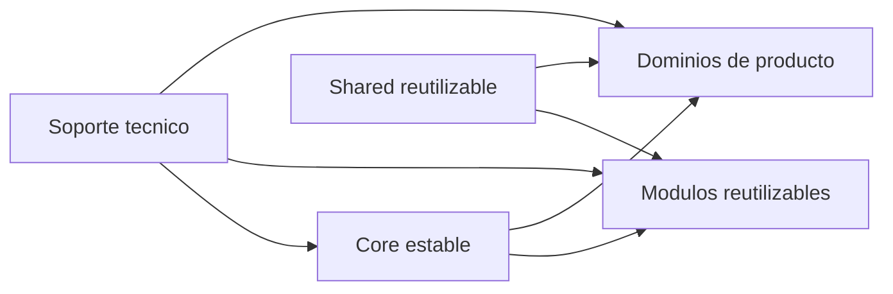

# Arquitectura de Meritech Foundation

Meritech Foundation se organiza en cinco areas conceptuales: Core, Modules, Domains, Shared y Support.

Estas areas no implican implementacion inmediata. Son limites arquitectonicos para guiar futuros desarrollos.

## Vista General

## Core

Core contiene las capacidades centrales de Foundation. Debe ser pequeno, estable y dificil de modificar sin una decision arquitectonica.

Responsabilidades esperadas:

- contratos base;
- reglas transversales;
- abstracciones minimas;
- convenciones internas;
- puntos de extension para modulos;
- integracion con capacidades base del stack.

Core no debe contener reglas de negocio de productos especificos.

## Modules

Modules representa capacidades funcionales reutilizables que pueden activarse, evolucionar o combinarse segun el producto.

Ejemplos candidatos:

- Auth;
- Users;
- Roles;
- Permissions;
- Tenancy;
- Settings;
- Branding;
- Notifications;
- Media;
- Audit;
- Dashboard;
- Search;
- QR;
- Payments;
- Communications.

Un modulo debe tener limites claros, dependencias explicitas y una razon reutilizable para existir.

## Domains

Domains representa contextos de negocio que pueden aparecer en productos concretos. A diferencia de Modules, un Domain puede ser mas especifico para una linea de producto.

Ejemplos conceptuales:

- un dominio de reservas;
- un dominio de catalogos;
- un dominio de clientes;
- un dominio de ordenes;
- un dominio de operaciones.

Foundation puede definir como se organizan los dominios, pero no debe asumir dominios de negocio antes de necesitarlos.

## Shared

Shared contiene piezas reutilizables que no pertenecen a un modulo especifico ni al Core.

Responsabilidades esperadas:

- value objects genericos;
- helpers controlados;
- componentes compartidos;
- recursos reutilizables;
- utilidades sin dependencia de producto.

Shared debe mantenerse simple. Si una pieza compartida comienza a tener reglas propias, puede necesitar convertirse en modulo.

## Support

Support agrupa infraestructura interna, herramientas de soporte y elementos tecnicos que ayudan al resto de la plataforma.

Responsabilidades esperadas:

- integraciones tecnicas;
- adaptadores;
- configuracion auxiliar;
- utilidades de desarrollo;
- observabilidad futura;
- soporte para pruebas y operaciones.

Support no debe exponer reglas de negocio a productos finales.

## Relacion Entre Areas

## Reglas Iniciales

- Core debe cambiar poco.
- Modules deben ser reutilizables.
- Domains deben representar negocio concreto.
- Shared debe evitar convertirse en una carpeta de descarte.
- Support debe sostener la plataforma sin imponer producto.
- Ninguna capa debe introducir referencias a Nexura, Restaurant, Menu, CRM o ERP como identidad de Foundation.
