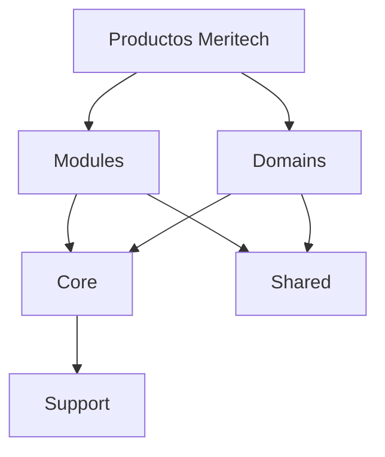

# Arquitectura de Meritech Foundation

Foundation se organiza alrededor de una idea central: una base tecnica reutilizable debe ser mas estable que los productos que se construyen sobre ella.

## Capas conceptuales

- Core: contratos, abstracciones y capacidades transversales minimas.
- Modules: capacidades reutilizables y activables por producto.
- Domains: contextos de negocio pertenecientes a productos finales, no a Foundation.
- Shared: piezas reutilizables sin reglas propias de producto.
- Support: infraestructura tecnica, integraciones y herramientas internas.

## Flujo esperado

## Reglas de arquitectura

- Core primero: las capacidades comunes se estabilizan antes de exponer modulos.
- Core debe cambiar poco y con ADR cuando el impacto sea estructural.
- Modules no deben depender de dominios de negocio.
- Domains no deben contaminar Core.
- Shared no debe convertirse en una carpeta de descarte.
- Support no debe imponer reglas de producto.

## Lectura desde el MCP

El indice `C-Users-jadcv-Herd-meritech-foundation-app` reporta una base Laravel con paquetes `Core`, `Http`, `Models`, `Providers`, migraciones, factories, seeders y tests. La zona mas relevante para la arquitectura propia de Foundation es `app/Core`, especialmente tenancy, contratos y provider base.

